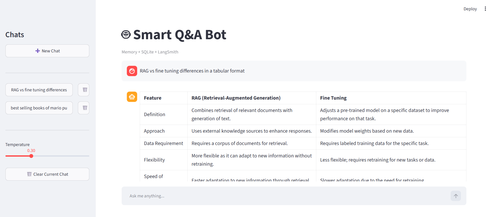
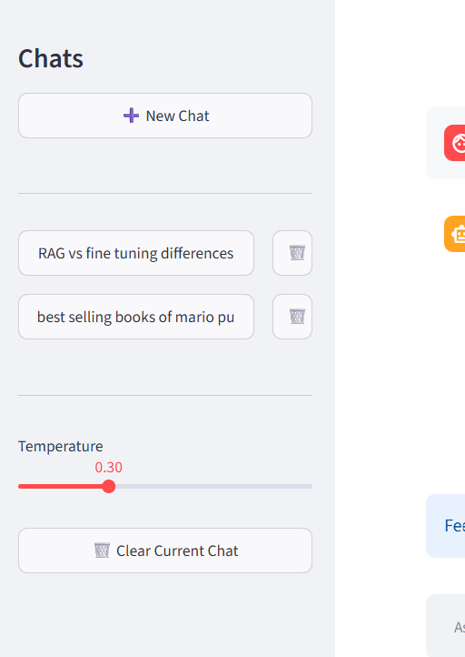
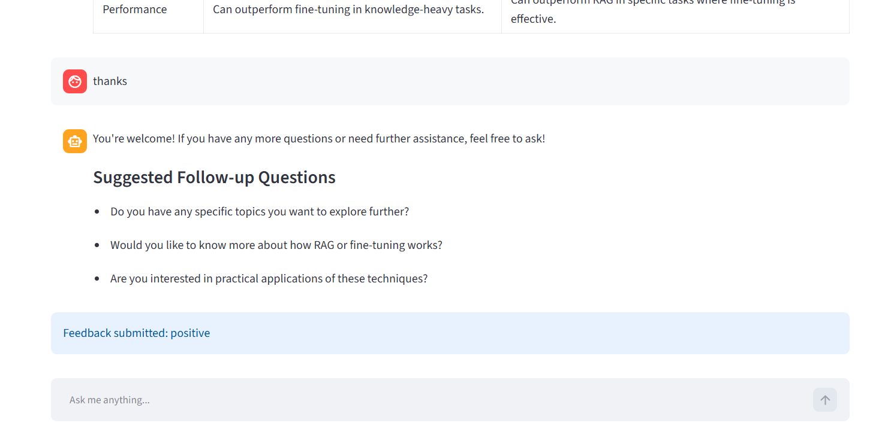
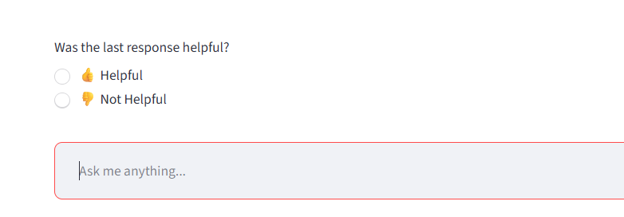
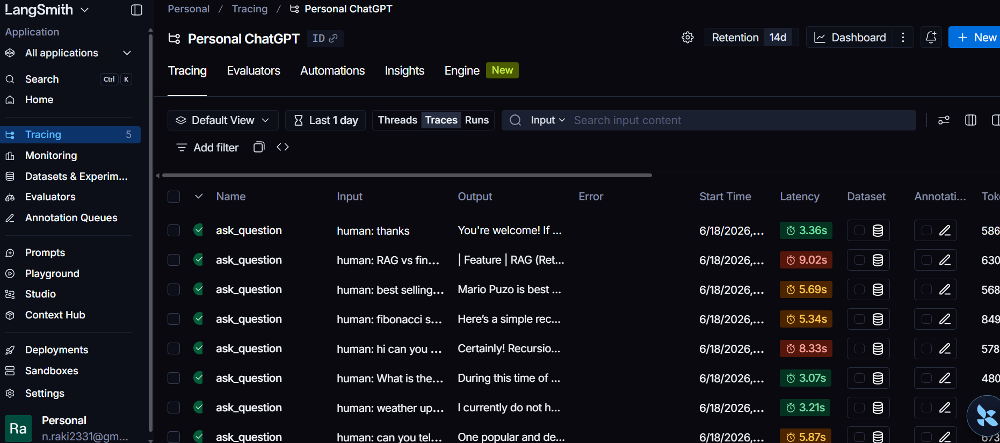
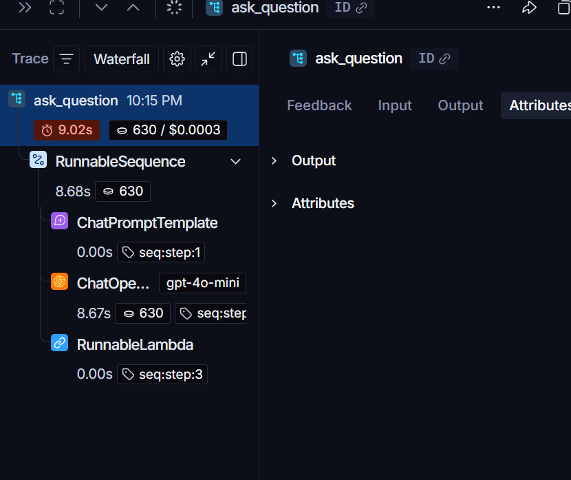
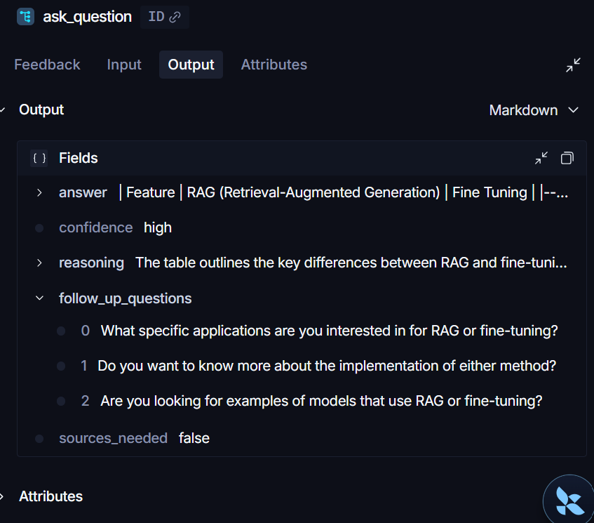
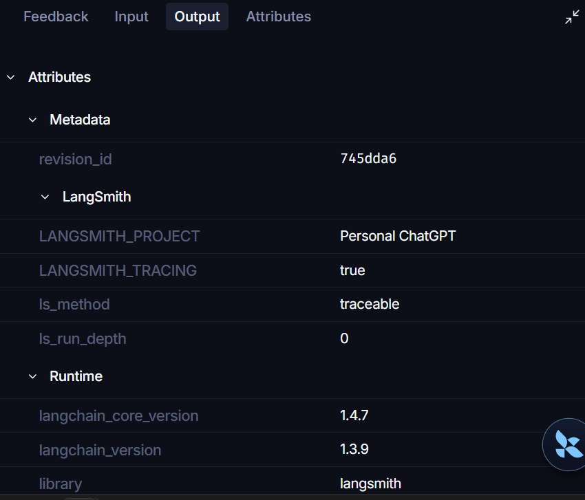

# 🤖 Smart Q&A Bot

<p align="center">


</p>

An intelligent conversational AI assistant built with **Streamlit**, **LangChain**, **OpenAI GPT-4o-mini**, **SQLite**, and **LangSmith**, featuring persistent chat sessions, structured outputs, follow-up question generation, memory, and user feedback collection.

InterActive-Bot follows a modular, layered architecture with dedicated components for UI, services, models, configuration, and observability, enabling clean separation of concerns and easier extensibility.

---

# ✨ Features

* 💬 Multi-session chat interface
* 🧠 Conversation memory
* 💾 Persistent chat history using SQLite
* 📌 Structured outputs using Pydantic models
* 🔄 Automatic follow-up question generation
* 👍 User feedback collection
* 🗑️ Session deletion and chat clearing
* 🌡️ Temperature control
* 📊 LangSmith observability and tracing
* 🏗️ Modular architecture
* 📦 UV package management

---

# 🏗️ Architecture

```text
User
  ↓
Streamlit UI
  ↓
SmartQABot
  ↓
LangChain Prompt
  ↓
GPT-4o-mini
  ↓
Structured QAResponse
  ↓
SQLite + Memory
  ↓
LangSmith Tracing
```

---

# 📸 Application Screenshots

## Main Chat Interface



---

## Session Management



---

## Follow-Up Question Generation



---

## Feedback Collection



---

# 🔍 LangSmith Observability

## Trace Dashboard



---

## Waterfall View



---

## Structured Output Inspection



---

## Runtime Metadata



---

# 📂 Project Structure

```text
InterActive-Bot
│
├── app.py
├── pyproject.toml
├── uv.lock
├── README.md
│
├── src
│   ├── components
│   │   ├── chat.py
│   │   ├── metrics.py
│   │   └── sidebar.py
│   │
│   ├── config
│   ├── models
│   ├── services
│   └── tracing
│
├── .streamlit
└── data
```

---

# 🧠 Structured Response Model

Every response is generated as a strongly typed object:

```python
class QAResponse(BaseModel):
    answer: str
    confidence: str
    reasoning: str
    follow_up_questions: list[str]
    sources_needed: bool
```

Example:

```python
QAResponse(
    answer="...",
    confidence="high",
    reasoning="...",
    follow_up_questions=[
        "...",
        "...",
        "..."
    ],
    sources_needed=False
)
```

---

# 🛠️ Tech Stack

| Component       | Technology  |
| --------------- | ----------- |
| UI              | Streamlit   |
| LLM             | GPT-4o-mini |
| Framework       | LangChain   |
| Observability   | LangSmith   |
| Storage         | SQLite      |
| Models          | Pydantic    |
| Package Manager | UV          |
| Language        | Python      |

---

# ⚙️ Installation

## Clone Repository

```bash
git clone https://github.com/raki0230/InterActive-Bot.git
cd InterActive-Bot
```

---

## Install Dependencies

```bash
uv sync
```

---

## Configure Environment Variables

Create a `.env` file:

```env
OPENAI_API_KEY=
LANGCHAIN_API_KEY=
LANGCHAIN_TRACING_V2=true
LANGCHAIN_PROJECT=Smart-QA-Bot
```

---

## Run the Application

```bash
uv run streamlit run app.py
```

---

# 📈 LangSmith Capabilities

* Chain-level tracing
* Waterfall visualization
* Runtime metadata inspection
* Token usage monitoring
* Latency tracking
* Structured output inspection
* Debugging and observability

---


# 👨‍💻 Author

### Ratna Kiran

* GitHub: https://github.com/raki0230
* LinkedIn: https://www.linkedin.com/in/ratna-kiran-b95010233

---

